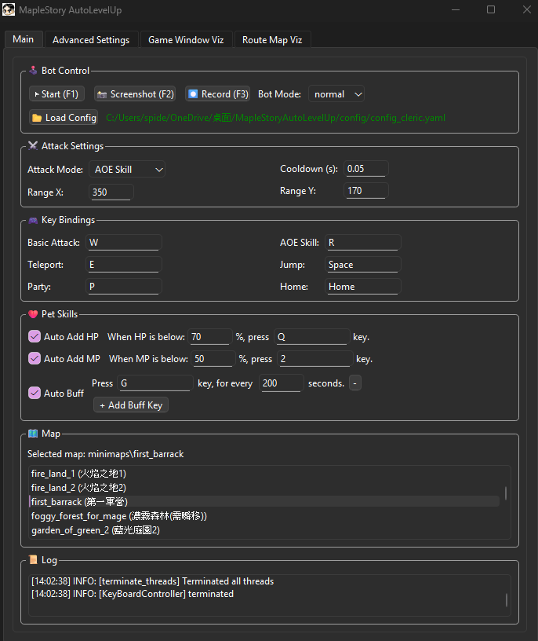
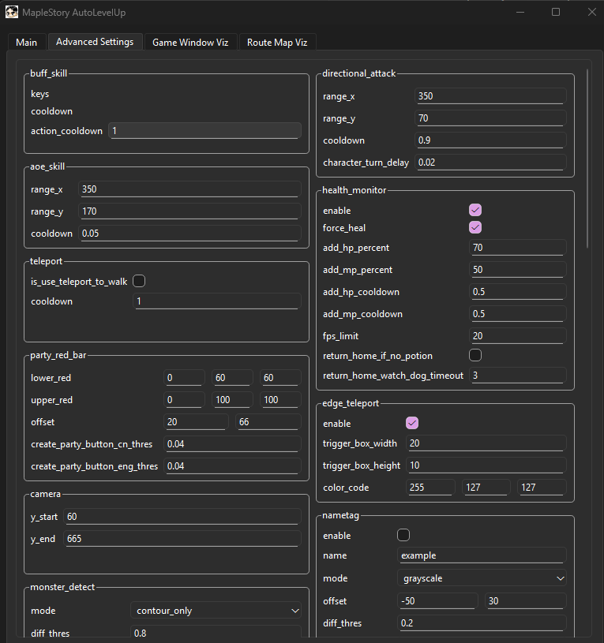

# Maple Story Auto Level Up
[English](README.md) | [繁體中文](README.zh.md)

An auto leveling up bot for Maple Story Artale

## Optimized Fork

This repository is maintained by
[@Micheal-tcy](https://github.com/Micheal-tcy) and is based on
[KenYu910645/MapleStoryAutoLevelUp](https://github.com/KenYu910645/MapleStoryAutoLevelUp).
The original authors and commit attribution are preserved under the MIT License.

The optimized fork currently includes:

- Correct SQDIFF non-maximum suppression (lower scores are better)
- A consistent `(height, width)` convention for detection sizes
- Safe operation when debug visualization is disabled
- Safer pause/restart and window-capture lifecycle handling
- Removal of committed email credentials
- Windows/Python 3.12 unit-test automation
- **Target any program window, not just "MapleStory Worlds"** (see below)

## Target Any Program Window

The bot is no longer hard-wired to the `MapleStory Worlds` window. You can point
it at any other MapleStory client, private-server client, or emulator window.

**From the UI (recommended):** open the *Main* tab and use the new **🎯 Target
Program** panel:

- **Window** – pick an open window from the drop-down (click **🔄 Refresh** to
  re-scan), or type part of its title.
- **Exact title match** – require the full window title to match instead of a
  substring (useful when several windows share similar names).
- **Auto-resize window** – force-resize the target window on start. Keep it on
  for MapleStory (detection expects a fixed resolution); turn it **off** for
  programs that must not be moved/resized.

**From config:** edit the `game_window` section in your config file:

```yaml
game_window:
  title: "Your Window Title"  # substring of the target window title
  exact_match: False          # True = require an exact full-title match
  auto_resize: True           # False = do not resize the target window
  resize_width: 1296          # window width used when auto_resize is True
  resize_height: 759          # window height used when auto_resize is True
```

> [!NOTE]
> The computer-vision detection (minimap, party red bar, monsters, runes) is
> tuned for MapleStory. Targeting a non-MapleStory program lets you capture and
> control that window, but the built-in detections may need their own templates
> to work well.

> [!WARNING]
> Automated gameplay may violate a game's terms of service and can put an
> account at risk. Review the rules for your server before using this project.


[▶ Watch demo on YouTube](https://www.youtube.com/watch?v=QeEXLHO8KN4)

## Download
[](https://github.com/KenYu910645/MapleStoryAutoLevelUp/releases/latest)

📥 **[Download the latest version here](https://github.com/KenYu910645/MapleStoryAutoLevelUp/releases/latest)**

## Run on Windows
1. Run MapleStory World and make sure the game is on windowed mode and game window size is resized to smallest
2. Turn on minimap on the top-left corner in the game.
3. Create a party in the game(press 'P' and click 'build'), and make sure a red bar shows on top of your character
4. Navigate your character to map you want to farm
5. **[Download the latest release](https://github.com/KenYu910645/MapleStoryAutoLevelUp/releases/latest)**
6. Unzip the MapleStoryAutoLevelUp.zip and run MapleStoryAutoLevelUp.exe
7. Adjust configuration on main tab in the UI
8. press 'Start' button or 'F1' to start the script
9. Have fun!

## Features
This work purely-based on Computer Vision technique, it doesn't required access game's memory. Instead, it detects image pattern(i.e., player red health bar and mobs) on game window screen and send simulated keyboard command to the game to control player's character.

✅ No game's memory access required

✅ Purely Computer Vision

✅ Simulates real keyboard input

✅ User friendly UI
|  |  |
|:-------------------------------:|:-------------------------------------------:|
| Main Tab UI                    | Advanced Settings UI                        |

✅ Auto solve rune


✅ Visualization window for debugging

✅ Auto HP/MP potion drink

✅ Auto change channel

✅ Auto dice rolling for character creation

✅ Support global/taiwan Artale server

✅ Support English and Traditional Chinese Language

## Environment
* Windows11/MacOS
* Python3.12
* OpenCV4.11

Note: this project DOES NOT support virtual environment(VM), it's only for recreational and academical use.

## ESP32-S3 Keyboard Input

All automated keyboard output is sent to the ESP32-S3 over a persistent USB
serial connection. The intended capture-card topology is:

```text
Game PC B --HDMI--> capture card / PotPlayer on computer A --> bot detection
Computer A --USB serial--> ESP32-S3 --Bluetooth HID--> game PC B
```

PotPlayer is a client-drawn window: its title skin, playback controls, and
letterbox/pillarbox pixels are included in Windows Graphics Capture. The
`auto` capture profile detects a PotPlayer title, removes that chrome, takes
the largest centered 16:9 HDMI region, normalizes it through the original
1282x693 game raster, and only then produces the 1296x700 vision frame:

```yaml
game_window:
  capture_profile: "auto"  # auto, direct, or potplayer
  potplayer_chrome_top: 34
  potplayer_chrome_bottom: 65
  potplayer_video_aspect_ratio: [16, 9]
  potplayer_resize_width: 2768
  potplayer_resize_height: 1656
```

The PotPlayer chrome values depend on its skin and Windows DPI scale. The log
prints the detected source size and exact video ROI whenever that geometry
changes. Keep computer B's game image filling the HDMI output without desktop
panels or overlays.

The stored `fire_land_1/map.png` is 319x202 because the route recorder added
about 30 pixels of black expansion padding around a 259x142 local minimap
raster. The calibrated 2768x1656 PotPlayer outer size makes the live minimap
closely match that local raster. The PotPlayer profile also restores the
extracted minimap to exactly 259x142 before route matching to absorb capture
card, skin, and DPI rounding. The rest of the frame stays on the original
1282x693 vision raster so monster and UI templates keep their expected scale.

Pair `Maple-ESP32-Keyboard` with game PC B before starting the bot. The default
configuration automatically finds an ESP32-S3 USB Serial/JTAG port:

```yaml
esp32_hid:
  remote_target: True
  serial_port: "auto"  # Or a fixed port such as "COM6"
  baudrate: 115200
```

`ESP32_HID_SERIAL_PORT` and `ESP32_HID_SERIAL_BAUDRATE` can override the YAML
values. Startup fails closed unless the board reports `BLE_READY=1`;
`--disable_control` skips
the ESP32 connection for detection-only debugging. With `remote_target: True`,
computer A's foreground window is intentionally ignored because MapleStory is
assumed to stay in front on B. Pausing, disconnecting, and exiting release every
held key; stale capture video also suspends input until fresh frames return.
The current firmware is keyboard-only, so remote mode does not run
any mouse-dependent workflow: party-window handling, channel switching,
automatic login/character selection, and local window activation are all
disabled. Firmware and setup instructions are in `esp32/README.md`.

For visual verification, select `debug` in the UI's **Bot Mode** list, select
the current map, open **Game Window Viz**, and press F1. Debug mode loads that
map's monster templates and draws full-camera detection boxes, but deliberately
does not connect to the ESP32 or run health, buff, login, party, or channel
workflows. Its stricter full-frame threshold can be adjusted with
`debug.monster_diff_thres` (edge-correlation score: higher means stricter).
Each green box shows the template name and confidence, so raise the value if
background boxes are being accepted, or lower it if a visible monster is
missed. Debug mode first keeps sparse local maxima (`local_peak_radius`) and at most `template_top_k`
candidates per template, which prevents full-frame matching from drawing
thousands of overlapping boxes. It performs that expensive scan every
`scan_interval_frames` frames and redraws the cached result between scans.

### Email Test Credentials

The experimental `tools/email_test.py` utility does not contain credentials.
Set these environment variables before running it:

- `MAPLE_BOT_SENDER_EMAIL`
- `MAPLE_BOT_EMAIL_PASSWORD`
- `MAPLE_BOT_RECEIVER_EMAIL`

Never commit real passwords or app passwords to a config file.

## Supported MapleStory Version
This project is mostly developed and tested on MapleStory Artale Taiwan Server and Global Server

## Run(Only for Developers)

### Install dependency
```
pip install -r requirements.txt
```

### Run with UI (Recommend)
Run command
```
python -m src.main
```
Press 'F1' or 'start' button to start auto bot

Tune the configuration to suit your character

Note that the advanced settings is still work in progress.
If you need to change advanced configs, please modify config_default.yaml

### Run without UI
#### Run script
```
python -m src.engine.MapleStoryAutoLevelUp
```
#### Run with a custom config
```
python -m src.engine.MapleStoryAutoLevelUp --cfg my_config
```
#### Disable debug visualization window
```
python -m src.engine.MapleStoryAutoLevelUp --disable_viz
```
#### Record the debug window
```
python -m src.engine.MapleStoryAutoLevelUp --record
```
#### Choose map via config_custom.yaml
Edit your map selection in the config file:
```
# In config/config_custom.yaml
bot:
  map: ""  # Set the map name. See available maps in config/config_data.yaml
```

#### Archer single-sided AoE

Directional characters can keep their normal attack and switch to a
single-sided AoE when enough monsters overlap the configured left or right
skill range. Add overrides like these to `config/config_custom.yaml`:

```yaml
bot:
  attack: directional
key:
  directional_attack: control  # Your normal attack key
  aoe_skill: shift             # Your single-sided AoE key; must be different
directional_aoe:
  enable: true
  min_monsters: 3              # Cast at this count or higher on one side
  range_x: 350
  range_y: 70
  cooldown: 0.9
  attack_recovery_delay: 0.9
```

If both sides reach the threshold, the bot chooses the side with more
monsters, then the nearer side when the counts are tied. While the AoE is on
cooldown, it waits instead of falling back to a normal attack.

#### Archer close-range Power Knock-Back

When a monster is too close for a bow attack, enable the close-range fallback
and bind Power Knock-Back to `S`:

```yaml
key:
  power_knockback: s
power_knockback:
  enable: true
  trigger_distance_x: 100     # Inclusive horizontal center distance
  range_y: 70
  cooldown: 0.9
  attack_recovery_delay: 0.9
```

A close monster blocks bow attacks on its whole side. If the opposite side has
a shootable monster, that side is attacked first. Power Knock-Back is used only
when no side has a valid bow target. The distance is expressed in the original
1296 x 700 reference pixels and is scaled automatically for the live capture.

* Press 'F1' to pause/continue the script control
* Press 'F2' to take a screenshot, which will be saved to screenshot/
* Press 'F12' to terminate script

## Supported Map
Please refer to config/config_data.yaml

## Want to Make a New Map? → Route Recorder

To design a custom route map, you can use the `routeRecorder.py` script.
It listens to your keyboard inputs and records them onto a route map.

Use the following command in your terminal to start recording:

```
python -m tools.routeRecorder --new_map <map_directory_name>
```
| Key  | Action                                     |
| ---- | ------------------------------------------ |
| `F1` | Pause or resume the recorder               |
| `F2` | Take a screenshot (saved to `screenshot/`) |
| `F3` | Save current route map and start a new one |
| `F4` | Save the current map to map.png            |

### Manually paint a portal activation region

The route recorder does not create portal markers. After saving a route,
manually edit the corresponding `minimaps/<map>/route*.png` file and paint a
filled horizontal region over the portal activation position:

- Color: RGB `(127, 255, 255)`, hex `#7FFFFF` (OpenCV BGR: `(255, 255, 127)`).
- Recommended size: approximately `11 x 5` minimap pixels. Keep it as one
  connected component and do not cover it with another route color.
- The action starts only when the detected Hero centroid overlaps the region.
  The bot holds `Up` and uses short left/right pulses, reversing before the
  connected region's horizontal edges.
- A successful in-map minimap jump ends the action. A failed attempt releases
  control after 6 seconds and is not retried until Hero leaves the region.
- RGB `(255, 255, 127)` remains the legacy `Down` route color and must not be
  used for portal regions.

### Manually paint a rope-climb guide

The route recorder is unchanged and does not create rope commands. After
saving a route, manually edit `minimaps/<map>/route*.png` and draw one exact-
color connected segment from the current platform approach toward the rope:

- Color: RGB `(0, 127, 255)`, hex `#007FFF` (OpenCV BGR: `(255, 127, 0)`).
- Put the near end where the normal platform route can discover it and the far
  end on the rope contact x-position. The bot detects the segment early and
  treats the endpoint farther from Hero as the rope position.
- Keep each guide as a separate connected component. Do not join two ropes or
  cover the segment with another route color.
- The bot generates its own takeoff point (8 minimap pixels by default). If
  Hero is already running toward the rope, that direction remains held and the
  jump is issued at the generated point with no stop. Otherwise the bot first
  repositions, then performs a left/right run-up followed by `Up + Jump`.
- Once mounted, the bot holds `Up`, detects upward minimap progress, and retries
  from the other side if a mount produces no progress. Existing routes keep
  their old behavior until this color is added manually.

* Please register mobs in config/config_data.yaml after creating a new map. 
* If this is a big map, it's recommended to scan the map first instead of start record route right away.
  Operate your character in the game and make sure you explore the whole map.
* Press 'F4' to update the current scanned map to debug window. If you are satisfied with current map, proceed to record route by pressing 'F3', it will refresh the whole route map.
* When recording route map, you can attack mobs on the way as the attack key won't be recorded.
* Typically, a raw record route map won't work very well. Use Paint tool to edit the route map, and fine tune the route

## Want to Make a New Monster? → Mob Maker

You can find the names of the monsters to be added at the following website:

[Maplestory GMS 65](https://maplestory.wiki/GMS/65/mob)

```
python tools/mob_maker.py

>Fetching mobs from: https://maplestory.io/api/GMS/65/mob
>You can find monster names at https://maplestory.wiki/GMS/65/mob
>Enter mob name:Snail  <-- Example
```

Automatically download monster PNG images, excluding death animation frames, since monsters do not need to be attacked again after death and therefore do not require recognition.

The monster actions such as `hit`, `move`, `skill`, and `stand` are retained. While it's uncertain whether keeping so many actions will affect performance, the expectation is that having a greater variety of monster animations will enhance the diversity and accuracy of monster recognition.

Once the download is complete, you can find the downloaded image in the `monster/{MonsterName}` folder.

## Auto Dice Roller
Auto Dice Roller help you roll the dice in character creation page.

User can assign the desire attributes and let the script do the job for you

```
python -m tools.AutoDiceRoller --attribute <STR,DEX,INT,LUK>

Example: for creating a full-INT wizard character:
python -m tools.AutoDiceRoller --attribute 4,4,13,4

Example: question mark is allowed if you don't want to assign a value
python -m tools.AutoDiceRoller --attribute 4,4,?,?
```
## Discord
Join our Discord server for more discussions

https://discord.gg/DqjtJGNEx7

## Legacy Version
This project previously use full-size screenshot map for camera localization
and route planning. However, I found that capturing player location from top-left corner minimap in the game is easier and more reliable.

Therefore, I developed a new localization scheme based on minimap, and all the previously maps/ are migrated to minimaps/ to benefit from this change. If you still want to use the old camera/player localization method. Please use the following command:

```
python -m src.legacy.mapleStoryAutoLevelUp_legacy.py --map <name_of_the_map> --monsters <name_of_the_monsters> --attack <skill>

Example:
python -m src.legacy.mapleStoryAutoLevelUp_legacy.py --map lost_time_1 --monsters evolved_ghost --attack aoe_skill
```

## ☕ Support the Developer

If you find this project helpful, consider supporting the developer by buying me a coffee!

> 💡 You can type in any amount you like — $1, $5, or $10 — whatever you're comfortable with.  
> 💵 Tips are in **USD**, not NTD.

[](https://www.buymeacoffee.com/kenyu910645)
